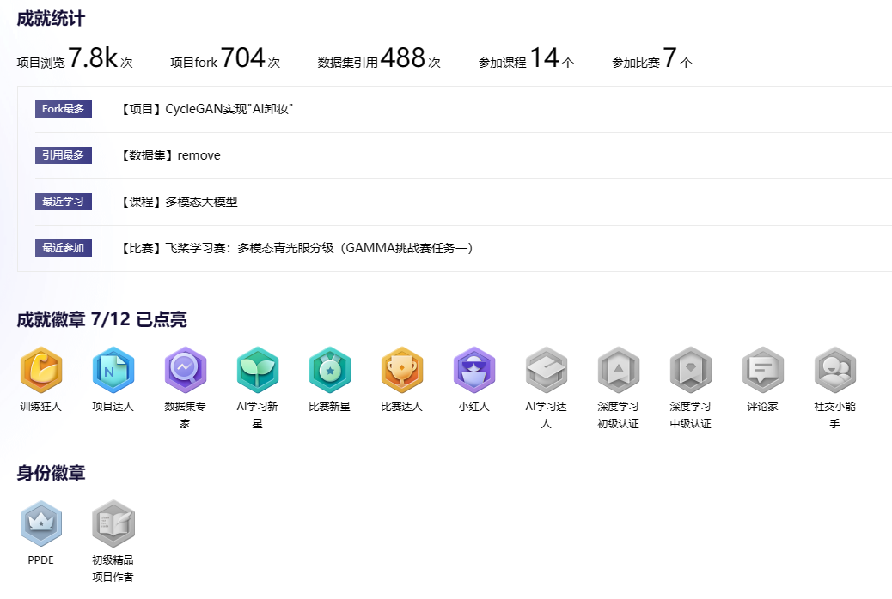

    
    
    

<h2 align="center">
    
Community Personal Homepage and PaddlePaddle Developers Experts (PPDE)

</h2>

<h4>🤗Please log in to AiStudio to access the homepage
</h4>

* **[PPDE-Home](https://www.paddlepaddle.org.cn/ppdemd?n=/ppdemd/%E9%83%91%E6%97%B6%E6%B6%9B)**.

<h4>🤗Boutique Projects of PaddlePaddle Developers Experts (PPDE)
</h4>

* **[CycleGAN实现"AI卸妆"](https://aistudio.baidu.com/projectdetail/656389)**.
  
* **[PaddleX实现小车装甲板识别及模型部署应用](https://aistudio.baidu.com/projectdetail/595720)**.

* **[用paddle实现轻量化卷积神经网络SqueezeNet](https://aistudio.baidu.com/projectdetail/600555)**.

* **[基于PaddleHub开发一款学生口罩佩戴情况检测登记系统](https://aistudio.baidu.com/projectdetail/598805)**.

<h4>🤗百度飞桨深度学习平台开发入门课程视频-郑时涛
</h4>

* **[百度飞桨深度学习平台开发入门](https://class.guyuehome.com/p/t_pc/goods_pc_detail/goods_detail/p_60375614e4b0478a0459c9a4?)**.
