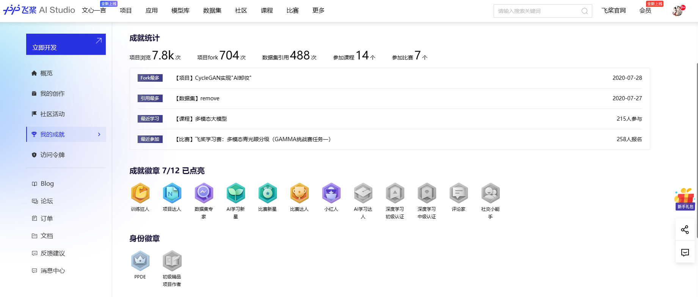

    
    
    

<h3 align="center">
    
Community Personal Homepage and PaddlePaddle Developers Experts (PPDE)

</h3>

<h4>🤗Please log in to AiStudio to access the homepage
</h4>

* **[AiStudio-Home](https://aistudio.baidu.com)**.

<h4>🤗Boutique Projects of PaddlePaddle Developers Experts (PPDE)
</h4>

* **[CycleGAN实现"AI卸妆"](https://aistudio.baidu.com/projectdetail/656389)**.
  
* **[PaddleX实现小车装甲板识别及模型部署应用](https://aistudio.baidu.com/projectdetail/595720)**.

* **[用paddle实现轻量化卷积神经网络SqueezeNet](https://aistudio.baidu.com/projectdetail/600555)**.

* **[基于PaddleHub开发一款学生口罩佩戴情况检测登记系统](https://aistudio.baidu.com/projectdetail/598805)**.